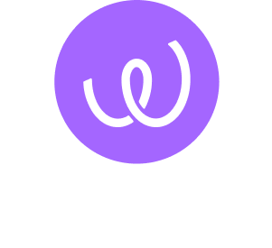

# FinTech Case Study: Energy Web Foundation
*By David Ordonez Martel*

## **_Overview and Origin_**

**Name of Company:** Energy Web Foundation  
**Incorporation Year:** 2017  
**Founders:**
Energy web chain co-founded by globally respected energy think-tank Rocky Mountain Institute (RMI) and noted blockchain developer Grid Singularity (GSy)
along with a cogort of 10 founding energy companies.

**Idea Generation:**
[Energy Web, initiated in 2017, resulted from a collaboration between RMI, a global non-profit with expertise in decarbonizing the energy sector, and Grid Singularity. The goal is to make the global energy transition successful by implementing digital technology that radically reduces the cost and complexity of coordinating various companies in the energy sector.](https://www.kraken.com/learn/what-is-energy-web-token-ewt#)

**Funding:**
[The Energy Web Foundation has raised approximately $20 million through several funding rounds, selling 21 million Energy Web Token (EWT) coins.](https://growjo.com/company/Energy_Web_Foundation)
## Business Activities

**Financial Problem:**
Energy Web aims to accelerate the energy transition by developing open-source Web3 technologies that help companies unlock business value from clean and distributed energy resources.

**Intended Customer:**
Energy Web focuses on developing "Green Proofs solutions" for various markets within the global energy sector, including electric vehicle charging, electricity companies, aviation, and bitcoin decarbonization, etc.

**Unfair Advantage:**
Energy Web provides unparalleled transparency in decarbonization efforts through Green Proofs, allowing independent verification of producers' attributes and data accuracy. The consortium of over 100 energy partners gives EWC a trust advantage.

**Technologies Used:**
1. **Energy Web Decentralized Operating System (EW-DOS)**
   - Web3 made enterprise-friendly
   - Enables seamless deployment of custom applications and business networks
   - Tech stack includes solutions for asset management, data exchange, and Green Proofs

2. **Green Proofs**
   - Customizable solution for tracking low-carbon products in complex supply chains
   - Unparalleled transparency in decarbonization efforts
   - Independent verification of producer attributes and data accuracy

3. **Energy Web Chain (EW Chain)**
   - Built on cryptocurrency principles with a shared infrastructure and incentive scheme
   - Derives blockchain code from Ethereum, focusing on energy sector functionalities
   - Middleware technology integration for real-world data reliance

4. **Proof of Authority (PoA) Consensus Mechanism**
   - Variation of Proof of Work for network synchronization
   - Limited validator nodes with specific eligibility criteria
   - Validators compensated with Energy Web Tokens (EWT) for honest participation

## **_Landscape_**

**Domain in Financial Industry:**
Building blockchain infrastructure tools for emerging clean energy companies.

**Major Trends and Innovations (Last 5-10 Years):**
- Blockchain Integration in Energy
- Decentralized Energy Grids
- Tokenization of Energy Assets
- Smart Contracts for Energy Agreements
- Renewable Energy Certificates (RECs) on Blockchain
- Grid Management and Optimization
- Digital Identities and IoT Integration
- Proof of Authority and Energy Efficiency
- Blockchain for Carbon Credits and Emissions Tracking
- Cross-Industry Collaborations

**Other Major Companies:**
[PowerLedger (POWR) RowanCoin (RWN) and any blockchain project with a smart contract feature.](https://www.coingecko.com/en/coins/energy-web)

## **_Results_**

**Business Impact:**
Acceleration of the clean energy transition in a more transparent and decentralized manner. 
Over time, Energy Web has grown to over 100 partnerships, including industry giants Tepco, Siemens, Shell, and Exelon.

**Core Metrics:**
- Adoption Rates
- Transaction Volume
- Decentralization Levels
- Token Valuation
- Smart Contract Execution
- Energy Efficiency
- Partnerships and Collaborations
- Compliance and Regulatory Alignment
- Customer Satisfaction
- Carbon Reduction Impact

## Recommendations

**Product/Service Suggestion:**
Develop a non-enterprise-grade wallet client.

**Benefits:**
Helps decentralize the blockchain even more by bringing in other node validators without relying on third-party centralized platforms.

**Technologies:**
Open-source technology, Ethereum smart contract technology, and token staking.

**Appropriateness:**
These technologies are widely used by beginner and advanced cryptocurrency users, and a s a result they would expand the use of the Energy Web Chain and bringing more revenue for transaction validators.

_____________________________________________________________________________________________________________________________________________

## Addendum: Citations
https://growjo.com/company/Energy_Web_Foundation

https://energywebx.medium.com/

https://www.energyweb.org/

https://www.kraken.com/learn/what-is-energy-web-token-ewt#

https://www.coingecko.com/en/coins/energy-web

______________________________________________________________________________________________________________________________________________

